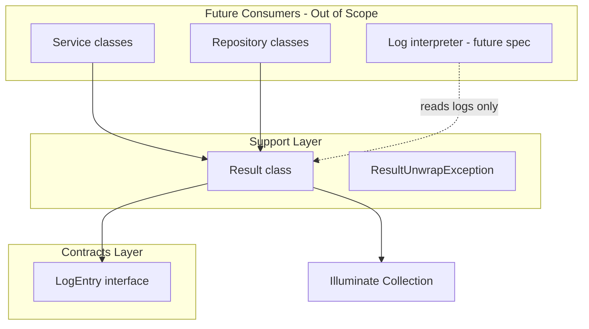
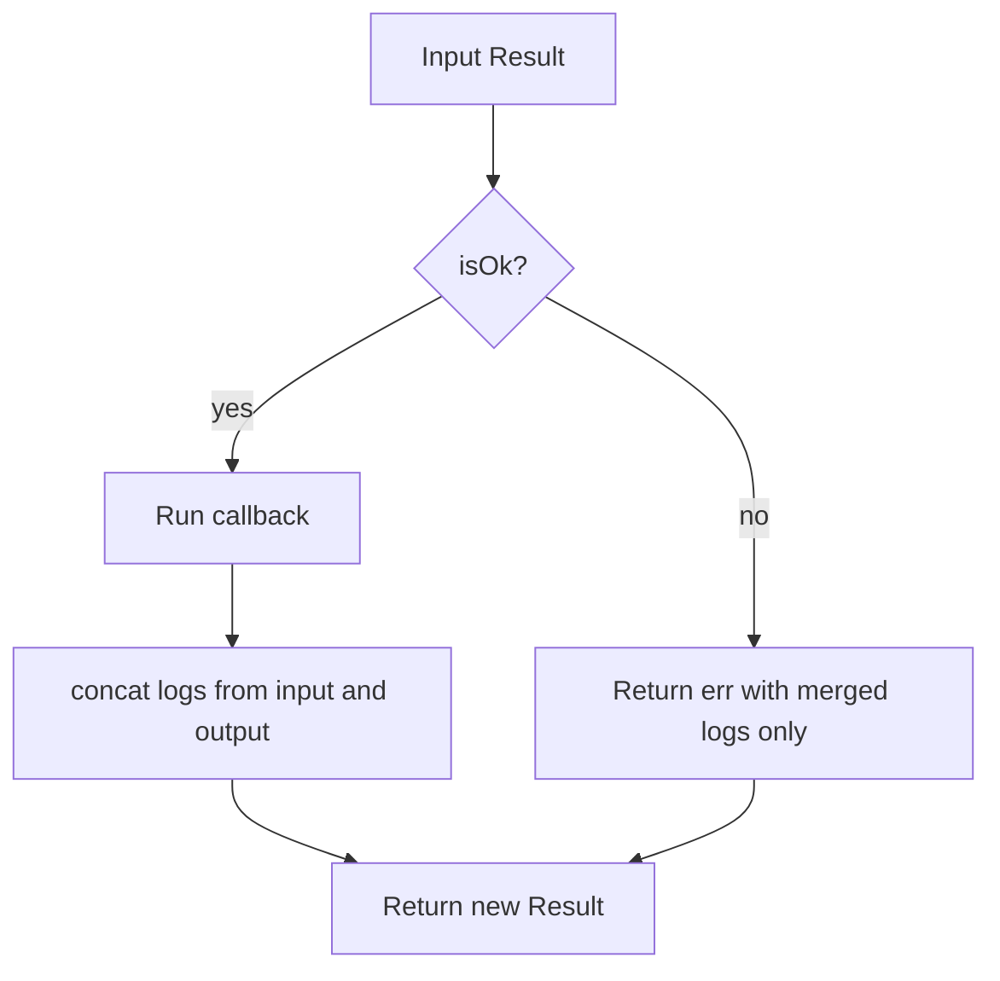
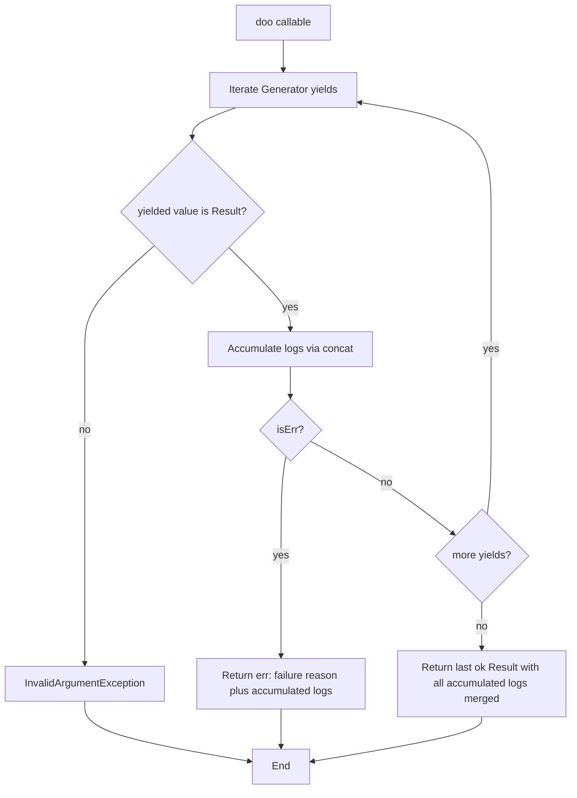

# Design Document: functional-result

## Overview

**Purpose**: アプリケーション開発者が成功値・失敗理由・処理ログを一つの `Result` 値として生成・変換・合成・逐次評価できる API を提供する。Either 的な短絡評価と Writer 的なログ collection 結合を単一の不変型に統合する。

**Users**: サービス層・リポジトリ層の実装者が、例外や null に依存せず戻り値と診断ログを同じパイプラインで扱うために利用する。

**Impact**: `app/Support/Result.php` と `app/Contracts/LogEntry.php` を新設し、将来のドメインサービスが共通の Result 契約に乗れる基盤を追加する。既存コードの一括移行は行わない。

### Goals
- 成功/失敗の排他的な状態、`map` / `bind` による短絡チェーン、ログ collection の順序付き結合
- Generator ベース `doo` による逐次評価と早期中断
- PHPDoc 総称型による静的解析向け公開契約（PHPStan 導入は別フェーズ）
- PHP 8.5 パイプ演算子と両立する unary callable ヘルパー

### Non-Goals
- Monolog / Laravel `Log` への出力 interpreter
- 具象 `LogEntry` 実装クラス
- 既存サービス・リポジトリの Result 化移行
- PHPStan / Larastan のパッケージ導入

## Boundary Commitments

### This Spec Owns
- `Result` の生成（`ok` / `err`）、状態判定、値取得、変換、合成、ログ結合
- `LogEntry` マーカー契約（ログエントリとして解釈可能な値の下限）
- `doo` による Generator ベース逐次評価
- 上記の PHPUnit 単体テスト

### Out of Boundary
- ログの外部出力・フォーマット・永続化
- ドメイン固有ログエントリの具象型
- HTTP / Eloquent / キュー等のフレームワーク統合
- 静的解析ツールの CI 組み込み

### Allowed Dependencies
- PHP 8.3+ 言語機能（パイプ演算子の**利用例**は 8.5+ を文書化）
- `Illuminate\Support\Collection`（ログ保持・結合）
- PHP 標準例外（`InvalidArgumentException`、`LogicException`）
- PHPUnit 12（`tests/Unit`）

### Revalidation Triggers
- `Result` 公開メソッドシグネチャまたは意味の変更
- ログ結合順序・短絡ルールの変更
- `LogEntry` 契約に必須メソッドを追加する変更
- `doo` の Generator 契約変更
- 失敗理由型の制約強化（例: Throwable 限定化）

## Architecture

### Existing Architecture Analysis
- プロジェクトは Laravel 13 スケルトン。横断ユーティリティの先例は未整備。
- steering に従い、フレームワーク非依存に近い純粋 PHP を `app/Support/` に、契約を `app/Contracts/` に配置する。
- Controller / Model への直接組み込みは本 spec のスコープ外。

### Architecture Pattern & Boundary Map

**Selected pattern**: 単一不変 Value Object（関数型 Result + 付随ログ）



**Architecture Integration**:
- **Selected pattern**: Immutable Result VO + marker LogEntry
- **Domain boundaries**: Support は HTTP/DB に依存しない。Contracts は実装を持たない
- **Existing patterns preserved**: PSR-4、`App\` 名前空間、PHPUnit Unit テスト
- **New components rationale**: Result（合成ロジック）、LogEntry（ログ要素の下限契約）、ResultUnwrapException（不正 unwrap の明示）
- **Steering compliance**: 明示的型、Sail、Pint、薄い Controller 方針を維持

### Technology Stack

| Layer | Choice / Version | Role in Feature | Notes |
|-------|------------------|-----------------|-------|
| Backend | PHP 8.3+（Sail 8.5） | Result 実装言語 | パイプ例は 8.5+ |
| Backend | Laravel 13 `Collection` | ログ collection | `concat` で順序結合 |
| Testing | PHPUnit 12 | Unit 検証 | `tests/Unit/Support/` |
| Static analysis | PHPDoc `@template` | 将来 PHPStan 向け契約 | ツール導入はスコープ外 |

## File Structure Plan

### Directory Structure
```
app/
├── Contracts/
│   └── LogEntry.php              # ログエントリのマーカー契約
└── Support/
    ├── Result.php                # Result 本体（ok/err/map/bind/doo 等）
    └── Exceptions/
        └── ResultUnwrapException.php  # 失敗 Result からの unwrap

tests/
└── Unit/
    └── Support/
        └── ResultTest.php        # Result 純粋ロジックの PHPUnit
```

### Modified Files
- なし（新規ファイルのみ）

## System Flows

### map / bind 短絡フロー



### doo 逐次評価フロー



**Key decisions**:
- `doo` は各 `yield` が返す **最後の Result** を成功時の戻り値とする（Req 5.1）。先行ステップのログはその Result に結合する。
- 失敗時は以降の Generator 評価を行わない（PHP Generator の自然な中断）。

## Requirements Traceability

| Requirement | Summary | Components | Interfaces | Flows |
|-------------|---------|------------|------------|-------|
| 1.1 | 成功生成 | Result::ok | ok factory | — |
| 1.2 | 失敗生成 | Result::err | err factory | — |
| 1.3 | 成功判定 | Result::isOk | — | — |
| 1.4 | 失敗判定 | Result::isErr | — | — |
| 1.5 | 排他状態 | Result（private ctor） | 不変条件 | — |
| 2.1 | 成功値取得 | Result::get | — | — |
| 2.2 | 失敗時 get 拒否 | Result::get, ResultUnwrapException | — | — |
| 2.3 | 成功時 getOr | Result::getOr | — | — |
| 2.4 | 失敗時 getOr 代替値 | Result::getOr | — | — |
| 3.1 | 成功時 map | Result::map | callable | map flow |
| 3.2 | 失敗時 map 透過 | Result::map | — | map flow |
| 3.3 | 成功時 bind | Result::bind | callable | map flow |
| 3.4 | 失敗時 bind 短絡 | Result::bind | — | map flow |
| 3.5 | パイプ向け callable | Result::map (static), Result::bind (static) | unary callable | — |
| 4.1 | 成功＋ログ生成 | Result::ok | Collection param | — |
| 4.2 | 失敗＋ログ生成 | Result::err | Collection param | — |
| 4.3 | ログ省略時空 collection | Result::ok, Result::err | デフォルト引数 | — |
| 4.4 | 変換・合成時ログ結合 | Result::mergeLogs private | concat | map/bind/doo |
| 4.5 | LogEntry 契約 | LogEntry, Collection PHPDoc | — | — |
| 5.1 | doo 全成功 | Result::doo | Generator | doo flow |
| 5.2 | doo 失敗中断 | Result::doo | — | doo flow |
| 5.3 | doo 成功時ログ結合 | Result::doo | — | doo flow |
| 5.4 | doo 失敗時ログ結合 | Result::doo | — | doo flow |
| 5.5 | 非 Result yield 拒否 | Result::doo | InvalidArgumentException | doo flow |
| 6.1 | 成功・失敗型契約 | Result @template | PHPDoc | — |
| 6.2 | map 後の型 | Result::map @template | PHPDoc | — |
| 6.3 | bind 後の型 | Result::bind @template | PHPDoc | — |
| 6.4 | ログ要素型 | Collection<int, LogEntry> | PHPDoc | — |
| 6.5 | 解析補助 PHPDoc | 全公開メソッド | @param @return | — |
| 7.1 | ログ保持責務 | Result | logs(): Collection | — |
| 7.2 | 出力責務なし | （設計上メソッドなし） | — | — |
| 7.3 | LogEntry 共通契約 | LogEntry | interface | — |
| 7.4 | 出力先非要求 | LogEntry（マーカー） | — | — |
| 7.5 | 一括移行不要 | — | スコープ外 | — |

## Components and Interfaces

| Component | Domain/Layer | Intent | Req Coverage | Key Dependencies | Contracts |
|-----------|--------------|--------|--------------|------------------|-----------|
| LogEntry | Contracts | ログ要素の下限契約 | 4.5, 7.3, 7.4 | なし | Service |
| Result | Support | 成功/失敗/ログの合成 | 1–6, 7.1 | Collection (P0), LogEntry (P0) | Service |
| ResultUnwrapException | Support | 不正 unwrap の明示 | 2.2 | — | Service |

### Contracts Layer

#### LogEntry

| Field | Detail |
|-------|--------|
| Intent | ログ collection に格納可能な値の共通マーカー |
| Requirements | 4.5, 7.3, 7.4 |

**Responsibilities & Constraints**
- 具象実装は要求しない（マーカー interface、メソッドなし）
- ドメイン側が任意の class / object を実装して付与する

**Dependencies**
- External: なし

**Contracts**: Service [x]

##### Service Interface
```php
namespace App\Contracts;

/**
 * ログ interpreter が解釈可能なエントリであることを示すマーカー。
 * 出力形式・永続化は本契約の責務外。
 */
interface LogEntry
{
}
```

**Implementation Notes**
- 将来メソッド追加（例: `level()`）は Revalidation Trigger

### Support Layer

#### Result

| Field | Detail |
|-------|--------|
| Intent | 成功値または失敗理由とログ collection を保持する不変 Result |
| Requirements | 1.1–6.5, 7.1 |

**Responsibilities & Constraints**
- 状態は `ok` または `err` のいずれか一方のみ（Req 1.5）
- 成功時: 非 null の成功値 + 失敗理由スロットは未使用
- 失敗時: 失敗理由 + 成功値スロットは未使用
- ログは常に `Collection<int, LogEntry>`（省略時は空）
- 外部ログシステムへの書き込みは行わない（Req 7.2）

**Dependencies**
- Outbound: `Illuminate\Support\Collection` — ログ保持・結合 (P0)
- Outbound: `App\Contracts\LogEntry` — 要素型制約 (P0)

**Contracts**: Service [x]

##### Service Interface

```php
namespace App\Support;

use App\Contracts\LogEntry;
use Illuminate\Support\Collection;

/**
 * @template TValue
 * @template TError
 * @phpstan-immutable
 */
final class Result
{
    /**
     * @template T
     * @param T $value
     * @param Collection<int, LogEntry>|null $logs
     * @return self<T, never>
     */
    public static function ok(mixed $value, ?Collection $logs = null): self;

    /**
     * @template E
     * @param E $reason
     * @param Collection<int, LogEntry>|null $logs
     * @return self<never, E>
     */
    public static function err(mixed $reason, ?Collection $logs = null): self;

    public function isOk(): bool;
    public function isErr(): bool;

    /**
     * @return TValue
     * @throws ResultUnwrapException 失敗状態のとき（Req 2.2）
     */
    public function get(): mixed;

    /**
     * @param TValue $default
     * @return TValue
     */
    public function getOr(mixed $default): mixed;

    /**
     * @return TError|null  失敗理由（成功時は null）
     */
    public function error(): mixed;

    /**
     * @return Collection<int, LogEntry>
     */
    public function logs(): Collection;

    /**
     * @template TNext
     * @param callable(TValue): TNext $callback
     * @return self<TNext, TError>
     */
    public function map(callable $callback): self;

    /**
     * @template TValue2
     * @template TError2
     * @param callable(TValue): self<TValue2, TError2> $callback
     * @return self<TValue2, TError|TError2>
     */
    public function bind(callable $callback): self;

    /**
     * @template TValue2
     * @template TError2
     * @param callable(): \Generator<int, self<TValue2, TError2>, mixed, mixed> $callback
     * @return self<TValue2, TError2>
     */
    public static function doo(callable $callback): self;

    /**
     * パイプ演算子向け unary callable。instance の map と同名の static メソッド。
     *
     * @template TNext
     * @param callable(mixed): TNext $callback
     * @return callable(self): self
     */
    public static function map(callable $callback): callable;

    /**
     * パイプ演算子向け unary callable。instance の bind と同名の static メソッド。
     *
     * @template TValue2
     * @template TError2
     * @param callable(mixed): self<TValue2, TError2> $callback
     * @return callable(self): self
     */
    public static function bind(callable $callback): callable;
}
```

- **Preconditions**:
  - `ok` / `err` はいずれも値または理由を受け取る。ログ collection の各要素は `LogEntry` 実装であること
  - `map` / `bind` のコールバックは成功状態でのみ呼ばれる
  - `doo` の Generator は各 yield で `Result` を返すこと
- **Postconditions**:
  - `map` / `bind` / `doo` は入力・出力のログを左から右へ `concat` した新しい Result を返す
  - 失敗状態の `bind` はコールバックを呼ばず、失敗理由と結合済みログを保持する
- **Invariants**: 単一 Result 内で成功値と失敗理由が同時に「有効」にならない

**Pipe operator usage**（PHP 8.5+、文書・テスト方針は実装タスクで決定）:

```php
$result = Result::ok($input)
    |> Result::bind(fn ($x) => step($x))
    |> Result::map(fn ($x) => transform($x));
```

**Implementation Notes**
- Integration: 将来のサービス戻り値型として利用。現フェーズでは Support のみ
- Validation: `doo` で `instanceof Result` でない yield は `InvalidArgumentException`
- Risks: `@template` と callable の組み合わせは PHPStan 未導入時はドキュメント価値のみ

#### ResultUnwrapException

| Field | Detail |
|-------|--------|
| Intent | `get()` が失敗 Result に対して呼ばれたことを明示 |
| Requirements | 2.2 |

**Contracts**: Service [x]

- `LogicException` を継承し、メッセージに失敗状態である旨を含める
- 失敗理由そのものは `error()` で取得する設計とし、例外メッセージへの埋め込みは必須としない

## Data Models

### Domain Model
- **Result**: 値オブジェクト。集約ルートではなく、永続化しない
- **LogEntry**: マーカー契約。ドメインイベントではなく診断用データの下限

### Logical Data Model

| 属性 | 型 | 備考 |
|------|-----|------|
| isOk | bool | 内部。外部は isOk/isErr |
| value | TValue \| unused | 成功時のみ有効 |
| reason | TError \| unused | 失敗時のみ有効 |
| logs | Collection<int, LogEntry> | 常に存在。デフォルト空 |

**Consistency**:
- `map` / `bind`: 新しい Result を生成（入力は変更しない）
- ログ結合: `logs_input->concat(logs_output)` で順序保持

## Error Handling

### Error Strategy
| 状況 | 応答 |
|------|------|
| 失敗 Result で `get()` | `ResultUnwrapException`（Req 2.2） |
| `doo` に Result 以外を yield | `InvalidArgumentException`（Req 5.5） |
| 失敗 Result で `getOr($default)` | 例外なし。`$default` を返す（Req 2.4） |

### Monitoring
- 本 spec はログ**保持**のみ。出力・メトリクスは将来の interpreter spec に委譲

## Testing Strategy

### Unit Tests (`tests/Unit/Support/ResultTest.php`)

1. **ok/err と isOk/isErr** — 1.1–1.5: 生成直後の状態と排他性（成功値・失敗理由が同時に取り出せないこと）
2. **get / getOr** — 2.1–2.4: 成功時の値返却、失敗時の例外、代替値フォールバック
3. **map 短絡** — 3.1–3.2: 成功時変換と失敗時の理由・ログ透過
4. **bind 短絡** — 3.3–3.4: 成功チェーンと失敗時コールバック未実行
5. **static map / bind（pipe 用）** — 3.5: 返却 callable が単一 `Result` 引数を受け取り合成できること（パイプ構文テストは PHP バージョンに応じて分割可）
6. **ログ保持・結合** — 4.1–4.4: 明示ログ、空ログ、`map`/`bind` 後の順序付き concat
7. **doo 成功・失敗** — 5.1–5.5: 全成功時の最終 Result、途中 err での中断、ログ結合、非 Result yield の例外
8. **error() と logs()** — 失敗理由取得、ログ collection のイミュータビリティ（返却 Collection の変更が内部状態を変えないこと）

### Integration / E2E
- 対象外（フレームワーク統合なし）

## Supporting References

### PHPDoc 方針（Req 6）
- クラス: `@template TValue`、`@template TError`（**不変**。`@template-covariant` は使用しない）
- `ok`: 戻り値 `self<T, never>` / `err`: `self<never, E>`
- `map` / `bind` / `doo`: メソッドレベルで `@template` を宣言し戻り値を具体化
- ログ: `@param Collection<int, LogEntry>` / `@return Collection<int, LogEntry>`

### composer PHP 制約
- 現状 `^8.3`。パイプ演算子を**実行する**テストを含める場合は `^8.5` への引き上げが必要（brief 制約）。実装タスクでいずれかを選択し、もう一方は PHPDoc サンプルのみとする。
